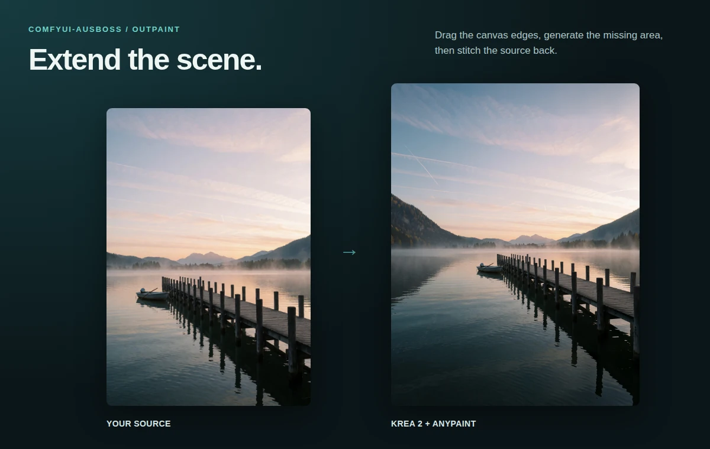
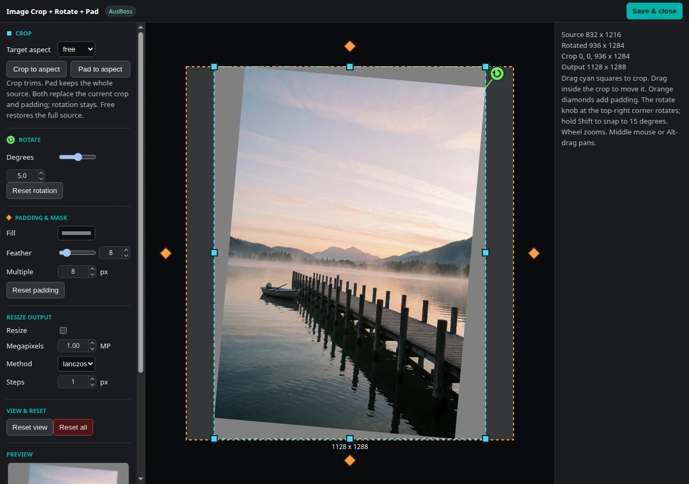
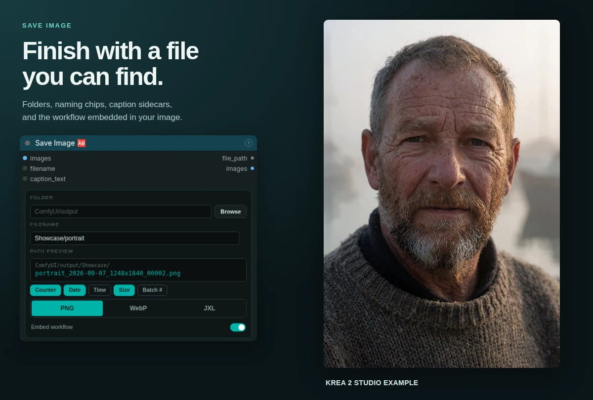
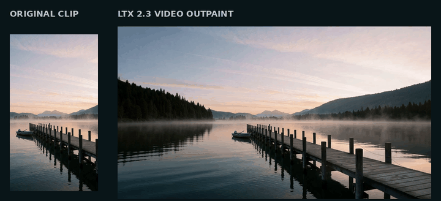
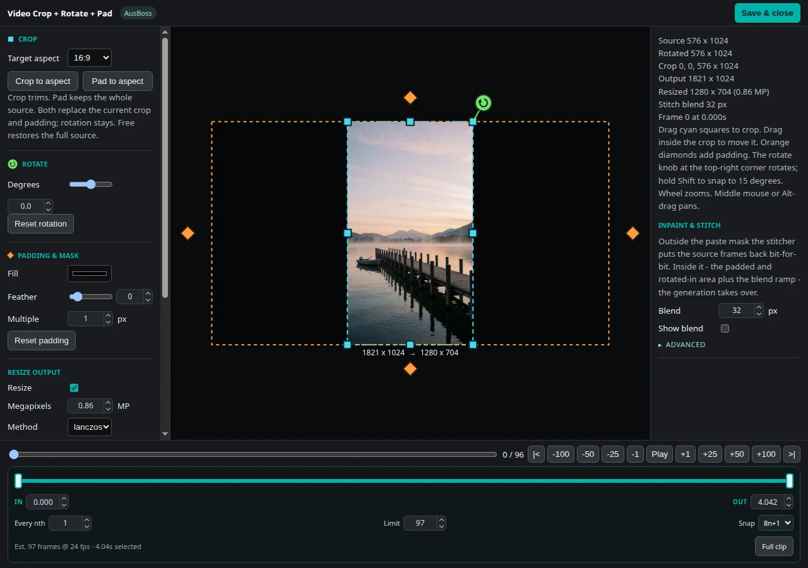
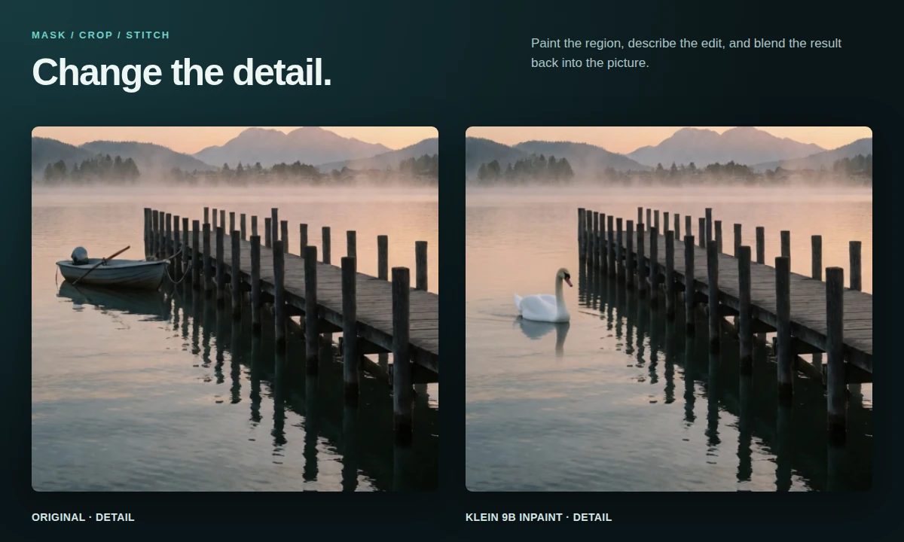
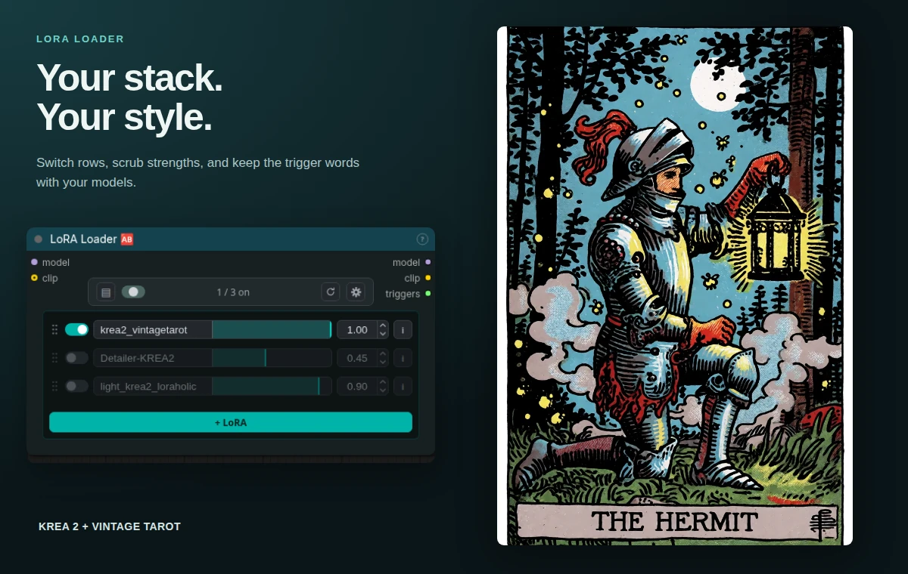
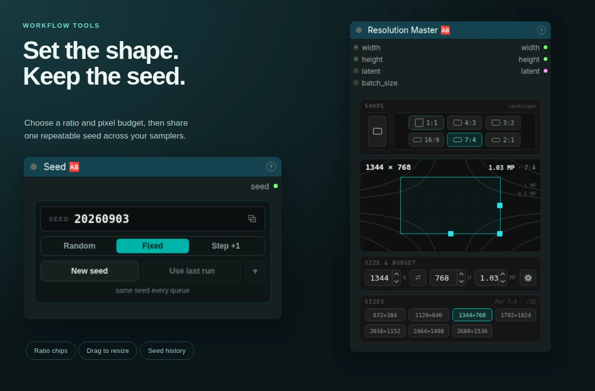

<div align="center">
  <h1>ComfyUI-AusBoss</h1>
  <p><strong>Polished nodes for the workflows I use most.</strong></p>
  <p>
    
    <!-- Dynamic: shields.io reads the version out of pyproject.toml on main
         at view time, so this badge can never go stale. release_preflight.py
         checks it stays the dynamic kind. -->
    
  </p>
</div>

ComfyUI-AusBoss provides compact image, video, inpaint, and workflow utility nodes. Numeric controls scrub by dragging, click to type, and use Shift for fine steps. Visual tools share the same crop, pad, and rotation controls. Every node has a **?** help card with its inputs, outputs, and usage notes.



**Make room for more.** Load Image + Pad prepares the canvas; Krea 2 + AnyPaint generates the extension; Stitch Inpaint brings the original back. [Open the outpaint workflow →](example_workflows/Krea%202%20Outpaint%20%28AusBoss%29.json)

## Start here

```bash
cd ComfyUI/custom_nodes
git clone https://github.com/ausboss/ComfyUI-AusBoss.git
```

Restart ComfyUI and search for **AusBoss**. After updating, hard-refresh the browser with **Ctrl+Shift+R**.

**Upgrading from 1.x:** 2.0.0 removes **LM Studio Chat**. Existing workflows using that node need a replacement; use **Text** when a fixed prompt is enough. All other public mapping keys are retained.

The pack uses Pillow, NumPy, Torch, and PyAV supplied by ComfyUI. Model workflows need the weights listed on their Workflow Note cards. LaMa additionally needs [`big-lama.pt`](https://github.com/Sanster/models/releases/download/add_big_lama/big-lama.pt) in `ComfyUI/models/lama/`; it never downloads weights automatically.

| Find a node | What is included |
|---|---|
| [Image](#image-nodes) | Load and transform, resize, align, measure, compare, save |
| [Video](#video-nodes) | Load and trim, pick a frame, transform a clip, interpolate, save |
| [Mask and inpaint](#mask-and-inpaint-nodes) | Refine masks, LaMa removal, crop and stitch |
| [Models and conditioning](#models-and-conditioning) | LoRA stack, Krea 2 prompt and reference conditioning |
| [Workflow utilities](#workflow-utilities) | Resolution, seed, batch operations, math, text, memory, notes, timer |
| [Examples](#example-workflows) | Fifteen grouped graphs with setup cards and thumbnails |

## Image nodes

### Image Crop + Rotate + Pad 🆎

Load an image and **rotate → crop → pad** it. Drag cyan crop handles, orange padding diamonds, and the green rotation handle directly on the compact preview, or open the full-screen editor for precise dimensions, zoom, and pan. Aspect chips pad the complete image to a chosen shape. Feather and output resizing are available on the node and in the editor.

Returns the transformed `image` and a generated-area `mask` covering padding, source transparency, and rotation corners. This is a general transform; for an outpaint that needs a source-preserving stitcher, use **Load Image + Pad**.



**Shape it by eye, finish with exact values.** The same handles work on the node and in the full-screen editor. [Try the image and video transform example →](example_workflows/Image%20and%20Video%20Transform%20%28AusBoss%29.json)

### Load Image + Pad 🆎

Build an outpaint canvas by dragging its edges. The card offers solid color, edge-average, edge-pixel, or blurred-image fill, a seam feather, canvas multiple, and megapixel budget. **Exact padding** opens one scrub control per side. A zero budget keeps the source size; a positive budget resizes the source before padding.

Returns the padded `image`, padding `mask`, `width`, `height`, a `stitcher`, and a smaller unpadded `reference` for conditioning. Connect the stitcher to **Stitch Inpaint** after generation to preserve the source outside the seam.

### Image Resize 🆎

Resize to **width × height**, longest edge, shortest edge, megapixels, or a scale factor. Fit inside a box, stretch to it, cover and crop, or pad with a chosen color. The card shows the controls relevant to the selected mode; width and height accept separate links.

An optional mask follows the same geometry. Outputs are `image`, `mask`, `width`, and `height`. Pad bars become white in the mask; otherwise a missing input mask stays black. `divisible_by` rounds the dimensions to a chosen multiple, and the interpolation control selects the image filter.

### Align Image 🆎

Snap dimensions to a chosen multiple through **resize**, **crop**, or **pad**. Crop and pad have position anchors; padding can use edge pixels or a solid color. Returns the aligned image and its width and height. Use it when a downstream model requires divisible dimensions without retyping a target size.

### Image Size 🆎

Read `width`, `height`, `longest_edge`, `shortest_edge`, and batch `count` as integers. Wire these into resizing, latent creation, frame-count calculations, or math so the workflow follows its source dimensions.

### Color Match 🆎

Match an image to a reference with **LAB**, **RGB**, **MKL**, or **histogram** transfer. Strength controls the blend; an optional mask and invert control limit the correction. With `reference_mode` set to **first frame**, every frame uses the batch's first frame as its reference. This can reduce color drift between frames, but does not stabilize motion.

### Image Compare A/B 🆎

Compare two images with a sliding reveal or a full-image A/B toggle. The picture remains unobstructed, with its resolution below it. The panel grows with the node and passes image A through, so it can sit anywhere along an image wire.

### Save Image 🆎

Choose an output folder, browse its subfolders, edit the filename, and check the live path preview. Counter, date, time, size, and batch-number chips build reusable names. Save **PNG**, **lossless WebP**, or **lossless JPEG XL**, with optional embedded workflow metadata.

Link `filename` to retain an upstream name, or `caption_text` to write a matching `.txt` sidecar for each image. The counter selects a free path; turning it off deliberately reuses the chosen path. JPEG XL needs the optional `pillow-jxl-plugin` extra. See the [full naming and compatibility notes](js/docs/AUSBOSS_NODES_SaveImage.md).



**From final render to organized output.** A portrait from the [Krea 2 Studio example](example_workflows/Krea%202%20Studio%20%28AusBoss%29.json), saved with its date, dimensions, and workflow.

## Video nodes



**Give a vertical clip a wider world.** This LTX 2.3 example extends the sides and stitches the source frames back into the result. The saved video retains the source audio; this preview is a silent loop. The IC-LoRA keys on the canvas, not the format: a pure black fill with feather 0 painted every aspect ratio tested, from 1:1 to 2.5:1 and on any side, while grey, white or feathered bands come back flat. [Open the video outpaint workflow →](example_workflows/LTX%202.3%20Video%20Outpaint%20%28AusBoss%29.json)

### Load Video 🆎

Upload a video and trim it with IN/OUT handles or typed timecodes. The player previews the selected window and can loop it. Width and height can resize during decode; setting only one preserves aspect. `every_nth` thins frames and adjusts the reported fps to preserve timing; `max_frames` limits the decode.

Returns frames, lazy audio, frame count, fps, width, height, duration, and a core `VIDEO` handle. Only the selected window is decoded, with a memory check before a large allocation. Connect its fps downstream when saving the frames.

### Video Crop + Rotate + Pad → Frame 🆎

Find **one frame** in an uploaded or local video, then apply the image transform controls. A playhead rail on the node scrubs to the frame; the editor adds exact frame stepping and playback. Returns one transformed `image` and its generated-area `mask`. Use the Clip variant for an entire sequence.

### Video Crop + Rotate + Pad → Clip 🆎

Apply one transform to every frame of a trimmed clip. The node combines source selection, a timeline with a playhead and frame-accurate IN/OUT handles, frame thinning, a frame limit, crop/rotate/pad handles, and output resizing. Dragging a trim handle shows the exact first or last frame the run keeps, and the selection's bright part is what reaches the output. Fill, feather and the resize budget sit on the node face, and a new clip keeps them, so the black hard-edged canvas a video outpaint model needs survives a source swap; a fresh Clip node starts with that canvas and the editor's Reset returns to it. **Snap** trims the tail to an 8n+1 or 4n+1 frame count when the next video model needs it. The format chips under the preview pad to a format in one tap and lock it on a second, so later crop and padding drags keep the aspect.

Returns frames, mask, audio, frame count, fps, size, duration, and a `stitcher`. **Inpaint & Stitch** in the editor controls the protected source region and blend preview. Wire that stitcher directly to **Stitch Inpaint** after a video outpaint; no intermediate Crop For Inpaint is needed. Processing is chunked to limit temporary memory.



**Frame, trim, and prepare the blend in one editor.** The timeline and protected-region preview belong to the same Clip node used in the video outpaint above.

### Select Frame 🆎

Select one unchanged frame from an image batch: **1** is the first, **-1** the last, and **-2** the next-to-last. Zero and out-of-range values report the valid range. The preview switch shows the selected frame or hides the picture and skips writing its preview file.

### Frame Interpolate 🆎

Retiming uses source and target **fps**, so 24 → 30 works alongside whole-number multiples. **Blend** crossfades frames; **optical flow** uses locally cached RAFT weights. Scene-cut detection holds frames across hard cuts instead of interpolating between unrelated shots. Chunked processing bounds working memory.

Returns the retimed frames and output fps. It does not process audio; carry the source audio separately to Save Video. See [weight setup and timing details](js/docs/AUSBOSS_NODES_FrameInterpolate.md).

### Save Video 🆎

Save an image batch or a core `VIDEO` as MP4 H.264/H.265, WebM VP9/AV1, ProRes MOV, lossless FFV1 MKV, GIF, or WebP. Available encoders depend on the local FFmpeg/PyAV build; the H.264/H.265 choices include CPU and NVENC options. Video outputs carry color tags, optional audio, and optional embedded workflow metadata.

**Ping-pong** runs forward and back without repeating the turnaround frames. A connected `VIDEO` supplies its own rate; otherwise wire fps from the loader or interpolator. The result player shows the encoded file. Dropping a supported saved video back onto the canvas restores its embedded graph. See [format and audio details](js/docs/AUSBOSS_NODES_SaveVideo.md).

## Mask and inpaint nodes



**Edit the part that matters.** Mask Refine, Crop For Inpaint, and Stitch Inpaint carry a painted region through this Klein 9B edit. Both pictures show the same detail crop. [Open the inpaint workflow →](example_workflows/Klein%209B%20Inpaint%20%28AusBoss%29.json)

### Mask Refine 🆎

Expand or shrink a mask, blur it, fill holes, smooth jagged edges, and adjust black and white points. The compact card starts with Expand and Blur; **More** opens the remaining controls. **AUTO** chooses expand and blur values from mask size. The optional preview shows the refined mask.

Returns the refined mask and its inverse. **Guided filter** and **matting** use a guide image and require their optional extras; the default **off** mode has no extra dependency.

### LaMa Inpaint 🆎

Replace white mask regions using a local TorchScript LaMa checkpoint. Black-mask pixels are preserved. One mask can serve an entire image batch, and video frames are processed one at a time to bound VRAM. The preview can stream completed frames during execution or be switched off.

Put `big-lama.pt` in `ComfyUI/models/lama/`. This is a frame-by-frame remover: difficult video textures may need additional temporal cleanup. The older `SimpleWatermarkRemover` mapping remains available as a compatibility alias.

### Crop For Inpaint 🆎

Crop the mask's bounding region with surrounding context, optionally resize it to a target size or megapixel budget, and return the cropped image, sampling mask, and stitcher. The card exposes the common mask and blend settings, with target sizing and canvas extension behind a disclosure.

The sampling mask and stitch blend are separate: mask growth/blur determines what the model can edit, while the blend margin determines how the result joins the original. Increase Context or Extra context when the model needs to see more of the surroundings. The `extend_*` controls can grow the canvas for outpainting.

### Stitch Inpaint 🆎

Paste a generated crop or outpaint back using a stitcher from **Crop For Inpaint**, **Load Image + Pad**, or **Video Crop + Rotate + Pad → Clip**. Pixels outside the blend region remain bit-identical to the stitcher's source. Video stitchers carry the per-frame originals.

**Tone match** reduces color discontinuities at the seam. **Fix edge halo** corrects a twice-blended rim and uses the optional matting extra; without it, the node warns and performs the normal stitch. See the [stitcher and batch contract](js/docs/AUSBOSS_NODES_StitchInpaint.md).

## Models and conditioning

### LoRA Loader 🆎

Keep a complete stack in one node: enable each row, choose a model from the searchable folder picker, and scrub its strength. The centered strength bars compare enabled rows on one scale; disabling the strongest row rescales the remaining bars. Model and CLIP strengths can be separated, and CLIP input is optional.



**One stack, a distinct look.** Krea 2 with the Vintage Tarot LoRA enabled; the other rows are parked for later. [Try the LoRA stack example →](example_workflows/Krea%202%20Text%20to%20Image%20%2B%20LoRA%20Stack%20%28AusBoss%29.json)

The toolbar holds the stack toggle, saved templates, reconnect, and settings. **Absorb loader chain** collects recognized loaders from the connected model chain and bypasses the originals. File metadata, optional Civitai lookup, and your saved words populate each LoRA's information card; selected trigger words flow through the `triggers` output.

Moved files resolve by basename when the match is unambiguous. A missing enabled LoRA stops validation by default. **Stop on missing LoRA** can be turned off to warn and skip instead. A LoRA that patches nothing on the model reports a warning naming the file.

### Krea 2 Encode 🆎

Encode positive and negative prompts in one card. With a VAE and reference images connected, it also attaches reference latents. Reference images are resized for conditioning; **VLM reference** controls whether the text encoder's vision tower also sees them. Leave the reference inputs empty for text-to-image.

The prompt supports multiline editing and incoming text links. See [reference preparation](js/docs/AUSBOSS_NODES_Krea2Encode.md) and use the matching example when combining it with an outpaint LoRA.

### Krea 2 Outpaint Model Patch 🆎

Register reference tokens at a defined place on the target canvas. Put the patch after LoRAs and before sampling; connect a stitcher and the reference conditioning from Krea 2 Encode.

The card exposes **Reference** placement and **KV cache**. Placement must match the adapter:

- **Whole canvas + AnyPaint:** the padded image is the reference, VLM reference is on, and a masked starting latent protects known pixels. Several sides can extend in one pass. This is the supplied Krea outpaint example.
- **Source rectangle + Registered Outpaint:** use the unpadded reference with VLM reference off. The source must span one complete canvas axis; extend left/right or top/bottom per pass, including any rounding padding.

The patch depends on ComfyUI's attention internals. Its [help page](js/docs/AUSBOSS_NODES_Krea2OutpaintModelPatch.md) explains both wiring contracts and the behavior without reference conditioning.

## Workflow utilities



**Small controls you can build a graph around.** Set the canvas once and share a seed across samplers. [Explore Resolution Master →](example_workflows/Resolution%20Master%20%28AusBoss%29.json)

### Resolution Master 🆎

Choose landscape or portrait, pick a ratio, adjust the megapixel budget, or drag the canvas handles. The orientation toggle remains independent of the ratio, including while square is selected. Typed width and height remain exact; gesture snapping is adjustable.

Returns width, height, and an empty **image latent**. The gear chooses 4-, 16-, or 128-channel layout and batch size. Latent dimensions use complete downsample cells; choose dimensions compatible with the selected layout when connecting the latent to a sampler. For video, use the width and height outputs with the model's own video latent node.

### Seed 🆎

Share one seed across samplers. **Random**, **Fixed**, and **Step** control what happens after generation. **New seed** rolls and pins a value; **Use last run** restores the value the backend actually used. The recent-history menu retains eight seeds and saves with the workflow.

### Select Every Nth 🆎

Keep every nth image, starting after a zero-based offset. For example, nth 2 with offset 0 keeps frames 1, 3, 5; offset 1 keeps 2, 4, 6. The output retains source order. This node changes the image batch only; adjust video timing separately.

### Split Batch 🆎

Split after a one-based frame index. Output **a** includes that frame; **b** contains the remainder. Both outputs must retain at least one frame, so invalid split points report the valid range.

### Merge Batches 🆎

Append batch **b** after **a**. Matching sizes remain unchanged. For different resolutions, resize to a's size, resize to b's size, or stop with an error. Channel counts must already agree.

### Text 🆎

A growing multiline card that passes its contents unchanged to a `STRING` wire. Use it for a prompt, caption, path, or other text shared by several nodes. Spaces and line breaks are retained.

### Integer 🆎

A scrub control that emits one `INT`. Share dimensions, counts, or other whole numbers through links.

### Float 🆎

A scrub control that emits one `FLOAT`. Share strengths, scales, frame rates, or durations through links.

### Math Expression 🆎

Calculate from linked `a`, `b`, and `c` inputs, each accepting integers or floats. Unwired variables read as zero. Supports arithmetic and `min`, `max`, `abs`, `round`, `floor`, `ceil`, and `sqrt` through a restricted expression parser.

Returns a float and a rounded integer; integer halves round away from zero. Use expressions such as `a * 2` or `ceil(a / 32) * 32` to derive values from upstream data.

### Show Text 🆎

Display incoming text in a selectable, resizable panel and pass it through unchanged. The last displayed text saves with the workflow. Long displays may be truncated, but the output retains the complete value. Runs as an output node, so no downstream consumer is needed.

### Free Memory 🆎

Pass any value through while unloading cached ComfyUI models, collecting Python garbage, and clearing the CUDA allocator cache where available. Put it between heavy stages when the next stage needs memory. It runs when its inputs change, respects graph caching, and may add model reload time downstream.

### Workflow Note 🆎

Add a title, Markdown instructions, model download links and destination folders, required node packs, and useful links. Installed models and packs are checked against the current instance. **Edit** changes the card; **Banner** makes a compact section title. The note never executes, and its text is not rendered as arbitrary HTML.

### Run Timer 🆎

A resizable stopwatch for the whole executing queue, with no wires. It starts when execution begins, holds the elapsed total when the run ends, and saves the last time with the graph. Recent times are available from its context menu. It is a display aid and does not change execution order.

## Example workflows

Open the JSON files from [`example_workflows/`](example_workflows), or use the pack's entries in ComfyUI's template browser. Each has a matching thumbnail, numbered groups, and a Workflow Note explaining setup and operation.

Copy the files in [`example_workflows/inputs/`](example_workflows/inputs) into `ComfyUI/input/` first. The rowboat PNG includes a painted mask. Model paths can include local subfolders: select the corresponding installed file in each loader before running. A green model indicator means the file exists; it does not guarantee the loader has selected that path. Model licenses and any download access requirements remain with their authors.

| Workflow | Purpose | Requirements |
|---|---|---|
| [Resolution Master](example_workflows/Resolution%20Master%20%28AusBoss%29.json) | Orientation, ratios, MP budgeting, and a solid-color preview | Core + this pack; no models |
| [Image and Video Transform](example_workflows/Image%20and%20Video%20Transform%20%28AusBoss%29.json) | Both transform editors, generated-area masks, alignment, and comparison | Core + this pack; included picture and clip |
| [AusBoss node tour](example_workflows/ausboss_node_tour.json) | Trim, split, merge, resize, mask, retime, compare, and save a clip | Core + this pack; included clip |
| [Krea 2 Studio](example_workflows/Krea%202%20Studio%20%28AusBoss%29.json) | Draft, learned upscale, low-denoise refinement, tone match, compare | Krea 2 Turbo components + a 4× upscaler |
| [Krea 2 Text to Image + LoRA Stack](example_workflows/Krea%202%20Text%20to%20Image%20%2B%20LoRA%20Stack%20%28AusBoss%29.json) | A stacked LoRA prompt with trigger words | Krea 2 Turbo + enabled style LoRAs; anime row is optional |
| [Krea 2 Prompt from Image](example_workflows/Krea%202%20Prompt%20from%20Image%20%28AusBoss%29.json) | Describe a picture with the text encoder, then render its prompt | Krea 2 components with core Text Generate support |
| [Krea 2 Outpaint](example_workflows/Krea%202%20Outpaint%20%28AusBoss%29.json) | Extend several sides, then stitch the source back | Krea 2 Turbo + AnyPaint LoRA |
| [Klein 9B Edit](example_workflows/Klein%209B%20Edit%20%28AusBoss%29.json) | Edit a picture at a source-derived working size | Distilled Klein 9B, Qwen encoder, Flux 2 VAE |
| [Klein 9B Inpaint](example_workflows/Klein%209B%20Inpaint%20%28AusBoss%29.json) | Refine the painted mask, crop, edit, and stitch | Same Klein components; included masked image |
| [Klein 9B Outpaint](example_workflows/Klein%209B%20Outpaint%20%28AusBoss%29.json) | Padded reference, masked starting latent, source-preserving stitch | Same Klein components + PixaOutpaint LoRA |
| [LTX 2.3 Video Outpaint](example_workflows/LTX%202.3%20Video%20Outpaint%20%28AusBoss%29.json) | Extend a clip's canvas while retaining source audio and pixels | LTX 2.3 components, distilled LoRA, outpaint IC-LoRA |
| [MiniMax H3 Text to Video](example_workflows/MiniMax%20H3%20Text%20to%20Video%20%28AusBoss%29.json) | Five-second request rounded to 124 frames, with generated audio | H3 FL2VA components + 4-step turbo LoRA |
| [MiniMax H3 Image to Video](example_workflows/MiniMax%20H3%20Image%20to%20Video%20%28AusBoss%29.json) | A short image-guided shot with generated audio | Same H3 components + turbo LoRA; included image |
| [MiniMax H3 First + Last Frame](example_workflows/MiniMax%20H3%20First%20%2B%20Last%20Frame%20%28AusBoss%29.json) | Two endpoint pictures and a 20-step base-model transition | H3 FL2VA components; two included images |
| [Simple Video Watermark Remover](example_workflows/simple_video_watermark_remover.json) | Detect and remove an overlay, with a single-frame comparison branch | **ComfyUI-RMBG / SAM3** plus `big-lama.pt` and this pack |

The fourteen other examples use core nodes plus this pack. Model-free examples are the quickest installation check. Generation speed and memory depend on the selected weights, dimensions, frame count, and other GPU workloads; the graph settings are reproducible, hardware timing is not.

## Editor controls and settings

- Cyan squares crop, orange diamonds pad, and the green handle rotates. Shift snaps rotation to 15°.
- In the full-screen editor, use the mouse wheel to zoom and middle mouse or Alt-drag to pan. On the compact node stage, wheel and middle mouse continue to control the graph.
- **Alt+E** opens the selected transform editor; change it in Settings → Keybindings.
- Video editors offer frame stepping, playback, and exact timeline seeking, on the node face as well as in the editor. The Clip node's IN/OUT handles are frames on the source's own grid, so the frame shown for IN is the first frame decoded and the frame shown for OUT is the last.
- Optional aspect presets live in `ausboss_presets.json` beside the pack. Copy [`ausboss_presets_example.json`](ausboss_presets_example.json) to start; the user file survives updates.

**Settings → 🆎 AusBoss** contains the pack color scheme, including AusBoss, Graphite, Slate, Teal, Moss, Plum, Rust, Navy, Custom, and Theme default. Hand-colored nodes keep their overrides. Right-click a node for its **AusBoss color** menu.

Under **Chrome**, queue status can appear in the browser title/favicon, live badges report node progress, and optional runtime badges display per-node execution time. LoRA Loader and Resolution Master have their own gear menus.

The video transform nodes' local path mode reads only videos inside ComfyUI's input, output and temp folders, and Save Image writes only inside the output folder: no widget can point the pack anywhere else on the disk; see [the video transform help](js/docs/AUSBOSS_NODES_VideoCropRotatePad.md).

## Optional extras

Install extras with the Python interpreter ComfyUI actually uses, from this pack's directory:

```bash
python -m pip install '.[guided-filter]'  # Mask Refine: guided filter
python -m pip install '.[matting]'        # Mask Refine: matting; Stitch: edge halo
python -m pip install '.[jxl]'            # Save Image: lossless JPEG XL
```

Default mask operations, ordinary stitching, PNG, and lossless WebP do not need these extras. Optical flow needs cached RAFT weights; model setup is described in the corresponding node help. Codec support depends on the ComfyUI environment.

## Compatibility and development

The declared minimum is ComfyUI **0.27.1**. Newer model examples require a core that includes their model family; updating only this pack cannot add missing core model support. The current review uses ComfyUI **0.34.5** with frontend **1.49.6**. The pack supports classic canvas and Nodes 2.0, and backend execution does not require an editor to be open.

Backend changes need a full ComfyUI restart. Frontend changes need a hard refresh. Use ComfyUI's Python for backend tests:

```bash
python scripts/validate_nodes.py
python scripts/release_preflight.py
python scripts/run_python_tests.py
node --test --test-isolation=none tests/*.test.mjs
```

Backend tests run in separate processes because their offline ComfyUI stubs must not leak between files. See [`docs/live_testing.md`](docs/live_testing.md) for canvas, mouse-drag, save/reload, and workflow execution checks. [`docs/adding_a_node.md`](docs/adding_a_node.md) and [`AGENTS.md`](AGENTS.md) define the public-node and release gates.

## License

MIT. See [`LICENSE`](LICENSE).
