<div align="center">
  <h1>ComfyUI-AusBoss</h1>
  <p>ComfyUI nodes for image and video work.</p>
  <p>
    
    <!-- Dynamic: shields.io reads the version out of pyproject.toml on main
         at view time, so this badge can never go stale. release_preflight.py
         checks it stays the dynamic kind. -->
    
  </p>
</div>

I made these nodes for my own ComfyUI workflows, mostly because I wanted features I couldn't find in other packs. I use them myself, and I keep adding new ones.

Most of them are for image and video work. You can rotate, crop and pad a picture by dragging handles on the node, trim a clip on a timeline, and outpaint or inpaint with your original pixels put back. ComfyUI's core nodes already cover the basics, like seeds, sizes and prompts, so use these where they add something.

The **?** in a node's title bar opens a short card with its inputs and outputs, and every node has a longer help page in ComfyUI's node help panel. I post the workflows I make with them on [Civitai](https://civitai.com/user/AusBoss) and [X @Zanzibased](https://x.com/Zanzibased).

## Install

In **ComfyUI-Manager**, open the Custom Nodes Manager, search for **AusBoss** and install it. From the command line, `comfy node install ausboss-nodes` does the same. To get the newest changes first, clone the repository instead:

```bash
cd ComfyUI/custom_nodes
git clone https://github.com/ausboss/ComfyUI-AusBoss.git
```

Restart ComfyUI and search the node library for **AusBoss**.

After an update, through Manager or `git pull`, restart ComfyUI and hard-refresh the browser with **Ctrl+Shift+R**. Otherwise the browser keeps the old JavaScript, and the pack warns you about it. A new version reaches Manager once the Comfy Registry has reviewed it, so GitHub can be a little ahead.

The pack uses the Pillow, NumPy, Torch and PyAV that come with ComfyUI. Each example lists the models it needs on its Workflow Note. LaMa Inpaint also needs [`big-lama.pt`](https://github.com/Sanster/models/releases/download/add_big_lama/big-lama.pt) in `ComfyUI/models/lama/`. The pack never downloads weights by itself.

### Upgrading from 1.x

2.0 removed **LM Studio Chat** (use **Text** for a fixed prompt) and Align Image's `offset_x` and `offset_y` outputs. Math Expression's `a`, `b` and `c` are sockets now instead of typed boxes, so put constants in the expression itself. 1.2 removed **Drop Shadow**, **Pad Image** (use **Load Image + Pad**) and **Frame Chooser**. Save Image writes only inside ComfyUI's output folder. The [changelog](CHANGELOG.md) has the details.

| Section | What's in it |
|---|---|
| [Image nodes](#image-nodes) | Rotate, crop and pad; resize, align and measure; match colors; realign edits; compare; save |
| [Video nodes](#video-nodes) | Load and trim, pick a frame, transform a clip, change the frame rate, save |
| [Mask and inpaint nodes](#mask-and-inpaint-nodes) | Refine masks, remove objects with LaMa, crop around a mask and stitch the result back |
| [Models and conditioning](#models-and-conditioning) | LoRA stack, Krea 2 prompts and references |
| [Workflow utilities](#workflow-utilities) | Canvas size, seed, batches, math, text, memory, notes, timer |
| [Example workflows](#example-workflows) | Seven workflows, each with a setup card |
| [For workflow creators](#for-workflow-creators) | Setup cards, before and after, repeatable seeds, measured run times |
| [Pack-wide tools](#pack-wide-tools) | Help cards, node colors, recreate and replace, run status, completion sound |

## Image nodes

### Image Crop + Rotate + Pad

Rotate, crop and pad a picture by dragging handles on the node. Cyan squares crop, orange diamonds pad, and the green handle rotates. It rotates first, then crops, then pads. The full-screen editor adds exact sizes, zoom and pan.

Tap a ratio under the preview to pad the picture to it, or to crop it with **Fit** set to crop. A lit ratio is the shape the canvas has right now: drag a handle to another shape and it goes dark, and the row says Custom. The padlock at the end of the row keeps the shape while you drag, and the button at the start turns the shape between portrait and landscape. **Reset crop** brings back the whole picture, and **Round canvas to** rounds the canvas to a multiple of pixels. Feather and output resizing are on the node and in the editor.

It returns the `image`, a `mask` of everything it added (padding, see-through parts of the source and the corners a rotation opens up), a `stitcher`, the untouched `original`, and the output `width` and `height`. Wire the stitcher into **Stitch Inpaint** after the sampler to put your original back. **Load Image + Pad** has more fill choices and a separate reference output.

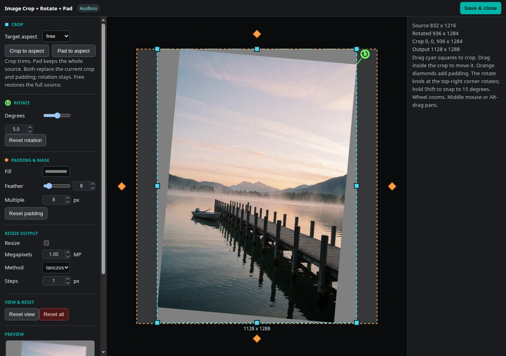

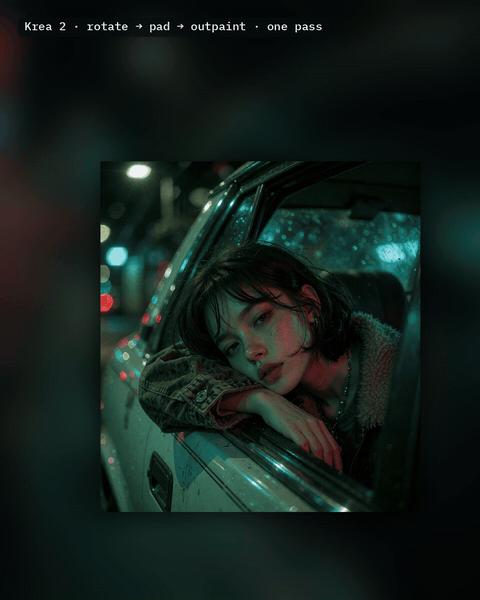

Krea 2 Rotate + Outpaint turns a photo, pads it and paints the new area in one pass. [Try the Krea 2 Rotate + Outpaint example →](example_workflows/Krea%202%20Rotate%20%2B%20Outpaint%20%28AusBoss%29.json)

### Load Image + Pad

Makes a canvas for outpainting: drag the edges out to add room around a picture. The Source list shows the picture under the pointer. The new area can be a solid color, the average color of the nearest edge, the edge pixels smeared outward, a blurred copy of the picture, or a mirror of it. The card also has a seam feather, a canvas multiple and a megapixel budget, and **Exact padding** opens one control per side. A budget of 0 keeps the picture's size, and anything higher resizes the picture before padding. A picture wired into `source_image` is padded instead of the chosen file.

It returns the padded `image`, a `mask` of the padding, `width`, `height`, a `stitcher`, and a smaller unpadded `reference` for the model. Wire the stitcher into **Stitch Inpaint** after the sampler, and everything outside the seam stays your original picture.

The Klein 9B Outpaint example pads its picture with Load Image + Pad. [Open the Klein 9B Outpaint workflow →](example_workflows/Klein%209B%20Outpaint%20%28AusBoss%29.json)

### Image Resize

Resizes to a width and height, a longest or shortest edge, a megapixel count, or a scale factor. It can fit inside the size, stretch to it, fill it and crop the rest, or pad with a color you pick. New nodes start in megapixels mode, and saved workflows keep their mode. The card shows only the controls for the chosen mode, and width and height each take their own link.

An optional mask is resized the same way. It returns `image`, `mask`, `width` and `height`. Padding shows up white in the mask, and with no mask wired in, the rest of the mask is black. `divisible_by` rounds the size to a multiple, and `interpolation` picks the resize filter.

### Align Image

Rounds a picture's size to a multiple you choose, by resizing, cropping or padding. Use it when the next model needs sizes that divide evenly and you don't want to type a target size. Crop and pad have anchors for where to cut or add, and padding can repeat the edge pixels or use a solid color. It returns the picture with its width and height.

### Image Size

Reads a picture's `width`, `height`, `longest_edge`, `shortest_edge` and batch `count` as whole numbers. Wire them into a resize, a latent, a frame count or Math Expression, so the rest of the graph follows the source's size.

### Color Match

Matches a picture's colors to a reference, with LAB, RGB, MKL or histogram transfer. Strength sets how much, and an optional mask (with invert) limits where. With `reference_mode` set to first frame, every frame of a batch matches the batch's first frame. That can cut down color drift in a clip, but it does not steady motion.

### Realign to Source (EXPERIMENTAL 🧪)

Lines an edited picture back up with the original. Qwen Image 2.1 often draws an edit, especially a style change, a little bigger or shifted: up to about 12% taller, by a different amount every seed. Wire in the edit and the picture it was made from. The node measures how far the edit moved and moves it back, at the original's size. It fixes the zoom and shift of the whole picture, not shapes the edit redrew in a new place, so the result lines up closely rather than pixel for pixel.

For the best result, pad the picture with Load Image + Pad's `mirror` fill before the edit and wire its `stitcher` in. The edit gets room to move, and you get back just your picture's area with real picture at the edges. Without that margin, an edit made at the picture's own size loses a thin strip the model pushed out of view. `empty_mask` marks that strip so you can crop or inpaint it, and **Empty fill** picks what it shows in the meantime.

**Fit** is `zoom + shift` (how Qwen edits drift) or `affine`, which also fixes a slight tilt. When the drift is a whole number of pixels, the node cuts the picture out as it is, with no resizing. `report` gives the measured zoom and shift, and the margin a side needed when an edit ran out of picture. A picture it can't measure passes through at the source's size, and the report says why. [Try the Qwen Image 2.1 Edit + Realign example →](example_workflows/Qwen%20Image%202.1%20Edit%20%2B%20Realign%20%28AusBoss%29.json)

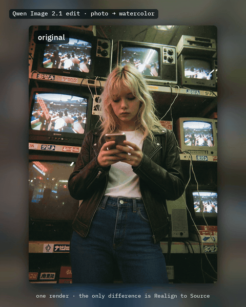

The same watercolor edit without and with Realign to Source: 61 px off before, 0.6 px after.

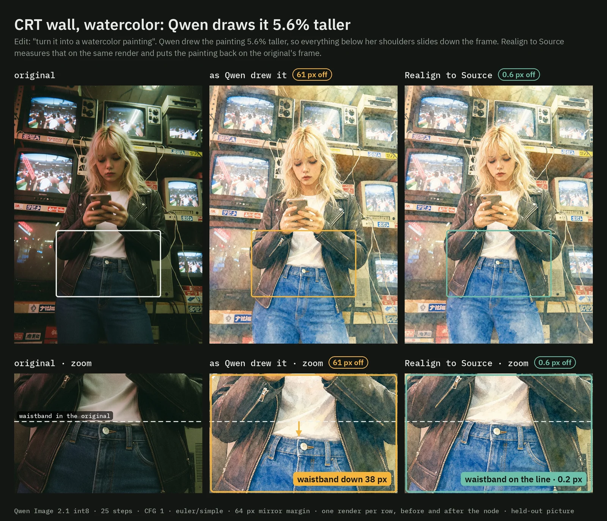

Qwen drew this watercolor 5.6% taller, and Realign to Source lined it back up with the original.

### Image Compare A/B

Compares two pictures with a slider, or flips between them whole. Nothing covers the picture, and its size shows underneath. The panel grows with the node, and image A passes through, so you can put it anywhere on an image wire.

### Save Image

Saves PNG, lossless WebP or lossless JPEG XL, with the workflow embedded if you want it. Pick a folder inside ComfyUI's output folder or browse its subfolders, edit the file name, and the path preview shows where the file will go. Chips add a counter, the date, the time, the size or a batch number to the name.

Link `filename` to keep a name from upstream, or `caption_text` to write a matching `.txt` next to each picture. The counter picks a name that isn't taken yet. Turn it off to reuse the same path on purpose. JPEG XL needs the optional `pillow-jxl-plugin` extra. The [help page](js/docs/AUSBOSS_NODES_SaveImage.md) has the full naming and compatibility notes.

## Video nodes

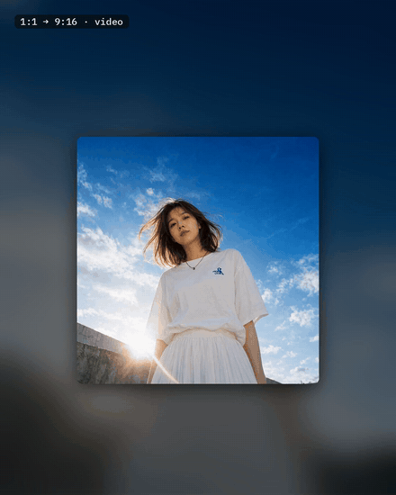

Here LTX 2.3 Video Outpaint takes a square clip to 9:16 and stitches the original frames back in.

The example keeps the clip's audio when there is any. The outpaint LoRA needs a pure black fill, since gray or white bands come back flat. With a black canvas it works at any aspect ratio and on any side. [Open the LTX 2.3 Video Outpaint workflow →](example_workflows/LTX%202.3%20Video%20Outpaint%20%28AusBoss%29.json)

### Load Video

Upload a video, or pick one from the Source list, which plays the clip under the pointer. Trim it with IN and OUT handles or typed timecodes. The player plays the part you kept and can loop it. Width and height resize while decoding, and setting only one keeps the shape. `every_nth` skips frames and lowers the reported fps so the timing stays right, and `max_frames` caps how many frames load.

It returns the frames, audio, frame count, fps, width, height, duration and a core `VIDEO`. Only the part you kept is decoded, and it checks memory before a large load. When you save the frames, wire its fps into the save node.

### Video Crop + Rotate + Pad → Frame

Picks one frame from a video, then gives you the same rotate, crop and pad controls as the image node, plus an optional megapixel resize. Scrub to the frame with the playhead on the node; the editor adds frame-by-frame stepping and playback. It returns the transformed `image`, a `mask` of the added area, a `stitcher`, the chosen `original` frame, and the output `width` and `height`. For a whole clip, use the Clip version below.

### Video Crop + Rotate + Pad → Clip

Applies one rotate, crop and pad to every frame of a trimmed clip. It has the source picker, a timeline with a playhead and frame-accurate IN and OUT handles, frame skipping, a frame limit, the transform handles and output resizing. While you drag a trim handle, the node shows the exact first or last frame the run keeps. The bright part of the selection is what gets output.

Fill, feather and the resize budget sit on the node face, and a new clip keeps them. That matters for video outpainting, because the black, hard-edged canvas the model needs survives a source swap. A fresh Clip node starts with that canvas, and the editor's **Reset transform** goes back to it. **Frames for** trims the end to the frame count the next video model takes: LTX (8n+1) or Wan (4n+1). Tap a ratio to pad the clip to it; a new clip is padded to the lit ratio too. The padlock keeps the shape while you drag a handle.

It returns the frames, mask, audio, frame count, fps, size, duration, a `stitcher`, and the chosen `original` frames before the transform. **Inpaint & Stitch** in the editor sets the protected source area and previews the blend. After a video outpaint, wire the stitcher straight into **Stitch Inpaint**, with no Crop For Inpaint in between. It works in chunks to keep memory down.

**Fixed frames** sets an exact output length: 120 frames at 24 fps is five seconds. Drag either handle, or drag the highlighted band to move the whole window. Type the count, or link a frame count into `fixed_frames`. 0 turns the fixed length off. The frame limit still caps the length.

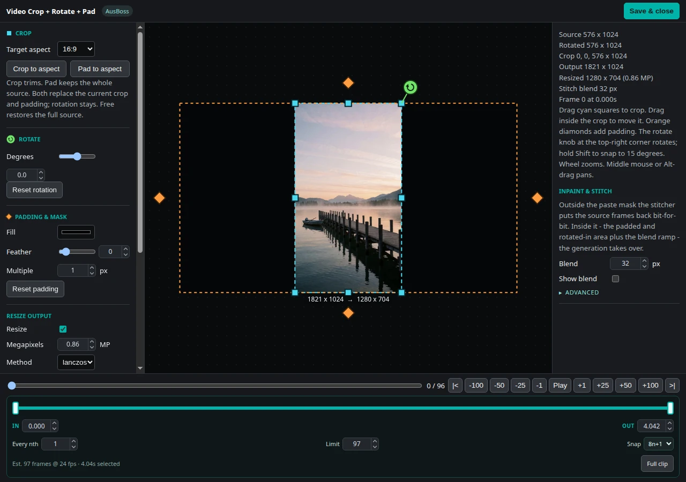

The Clip node's editor, from the video outpaint example.

### Select Frame

Picks one frame from a batch, unchanged: `1` is the first, `-1` the last and `-2` the one before it. 0, or a number past the end, stops with an error that gives the valid range. The preview switch shows the frame, or hides it and skips writing the preview file.

### Frame Interpolate

Changes a clip's frame rate by making in-between frames. You set the source and target fps, so 24 to 30 works as well as doubling. The blend method crossfades frames, and optical flow uses RAFT weights you put in place yourself. At a hard cut it holds the frame instead of blending two unrelated shots. It works in chunks to keep memory down.

It returns the new frames and their fps. It doesn't touch audio, so carry the source audio to Save Video separately. The [help page](js/docs/AUSBOSS_NODES_FrameInterpolate.md) covers the weights and timing.

### Save Video

Saves a frame batch or a core `VIDEO` as MP4 (H.264 or H.265), WebM (VP9 or AV1), ProRes MOV, lossless FFV1 MKV, GIF or WebP. Which encoders you get depends on your FFmpeg and PyAV build, and H.264 and H.265 come in CPU and NVENC versions. The videos carry color tags, and optionally audio and the workflow.

**Ping-pong** plays forward and then back without repeating the turnaround frames. A wired `VIDEO` brings its own frame rate; otherwise wire fps from Load Video or Frame Interpolate. The player on the node shows the saved file. Drop a saved video back on the canvas to load the workflow inside it, for the formats that can hold one. The [help page](js/docs/AUSBOSS_NODES_SaveVideo.md) has the format and audio details.

## Mask and inpaint nodes

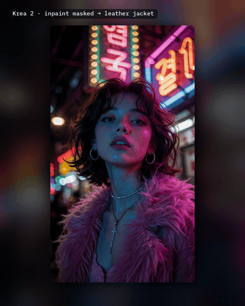

Krea 2 Inpaint Masked turns the painted fur coat into a leather jacket, using Mask Refine, Crop For Inpaint and Stitch Inpaint. [Open the Krea 2 Inpaint Masked workflow →](example_workflows/Krea%202%20Inpaint%20Masked%20%28AusBoss%29.json)

### Mask Refine

Grows or shrinks a mask, blurs it, fills holes, smooths jagged edges, and sets black and white points. The card shows Expand and Blur, and **More** opens the rest. **AUTO** picks expand and blur values from the mask's size. The optional preview shows the result.

It returns the refined mask and its inverse. The `guided filter` and `matting` edge modes use a guide picture and each need an optional extra (see [Optional extras](#optional-extras)). The default, `off`, needs nothing extra.

### LaMa Inpaint

Removes what is under the white part of a mask and fills the hole from the surroundings, using a local LaMa model. Pixels under black stay as they are. One mask can cover a whole batch, and video frames go through one at a time to keep VRAM use down. The preview can show frames as they finish, or be switched off.

Put `big-lama.pt` in `ComfyUI/models/lama/`. It works one frame at a time, so a hard texture in a video may need more cleanup across frames. The old `SimpleWatermarkRemover` node id still loads, so older workflows keep working. [Try the Simple Video Watermark Remover example →](example_workflows/Simple%20Video%20Watermark%20Remover%20%28AusBoss%29.json)

### Crop For Inpaint

Crops the masked area plus some of what's around it, and can resize the crop to a target size or megapixel budget. It returns the cropped `image`, the `mask` the model paints in, and a `stitcher`. The card shows the usual mask and blend settings, and target size and canvas extension fold behind a disclosure.

The mask and the blend are separate. Growing or blurring the mask changes what the model can repaint, and the blend margin changes how the result joins the original. Raise **Context** or **Extra context** when the model needs to see more around the area. **Stay in picture**, on by default, stops the crop at the picture's edges. The `extend_*` controls grow the canvas for outpainting.

### Stitch Inpaint

Puts a generated crop or outpaint back into the original, using the stitcher from Crop For Inpaint, Load Image + Pad or any Crop + Rotate + Pad node. Everything outside the blend area keeps the stitcher's original pixels exactly. A video stitcher carries every original frame.

For a turned picture, or an outpaint with Tone match off, set **Seam** to **blend in** in the card's gear menu. It fades the model's picture into yours with no tone shift. **Tone match** evens out color steps at the seam. **Fix edge halo** cleans up a rim that got blended twice. It needs the optional matting extra, and without it the node warns and stitches normally. The [help page](js/docs/AUSBOSS_NODES_StitchInpaint.md) explains the stitcher and batches.

## Models and conditioning

### LoRA Loader

A whole LoRA stack in one node. Each row has an on switch, a searchable picker for the file and a strength you scrub. The strength bars share one scale, so the rows are easy to compare, and switching off the strongest row rescales the rest. Model and CLIP strengths can be split, and the CLIP input is optional.

The toolbar has the stack toggle, saved templates, reconnect and settings. The toggle turns the whole stack off, and back on to the rows you had on. **Absorb chain LoRAs** in the settings menu moves a chain of other LoRA loaders into this stack, in the order they applied, repeats included. It bypasses the old loaders only when every MODEL, CLIP and other connection can be kept. A shared branch or linked stack settings leave the chain alone.

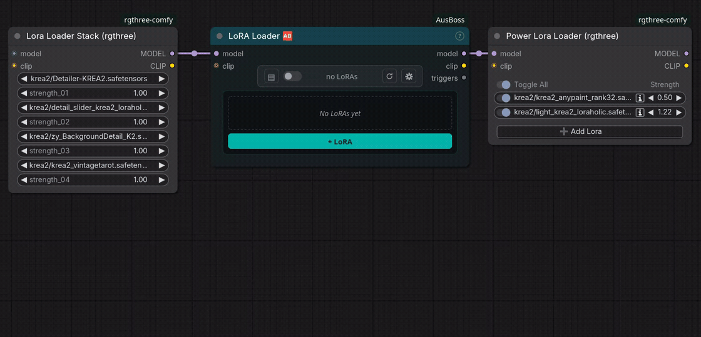

Each LoRA gets an info card from the file's metadata, a `.civitai.info` file next to it, and words you save yourself. The trigger words you pick come out of the `triggers` output.

When a file has moved, the node finds it by name if only one file matches. A missing LoRA that is switched on stops the run by default. Turn off **Stop on missing LoRA** to warn and skip it instead. A LoRA that changes nothing in the model gets a warning with its file name.

### Krea 2 Encode

Krea 2's positive and negative prompts in one card. Connect a VAE and reference pictures, and it adds them as references too, resized for the model first. **VLM reference** sets whether the text encoder also looks at them. Leave the references empty for plain text to image. For an outpaint, connect the pad node's mask too: the model then sees the new area in your picture's own colour instead of gray, so it paints it rather than keeping a gray frame.

The prompt box takes several lines and a linked text. The [help page](js/docs/AUSBOSS_NODES_Krea2Encode.md) covers preparing references. With an outpaint LoRA, copy the wiring from the matching example.

### Krea 2 Outpaint Model Patch

Tells Krea 2 where a reference picture sits on the canvas. It's made for Krea 2 outpaint LoRAs, and the two that exist want different placements. Put it after the LoRAs and before the sampler, and connect a stitcher and the reference conditioning from Krea 2 Encode.

The card has **Reference** placement and **KV cache**. The placement has to match the LoRA:

- **Whole canvas + AnyPaint:** the padded picture is the reference, VLM reference is on, the pad mask goes into Krea 2 Encode's `mask`, and a masked starting latent keeps the known pixels. Several sides can extend in one pass. The Krea 2 Outpaint example works this way.
- **Source rectangle + Registered Outpaint:** use the unpadded reference with VLM reference off. The source has to span the whole canvas in one direction, so extend left and right, or top and bottom, in each pass, including any padding added for rounding.

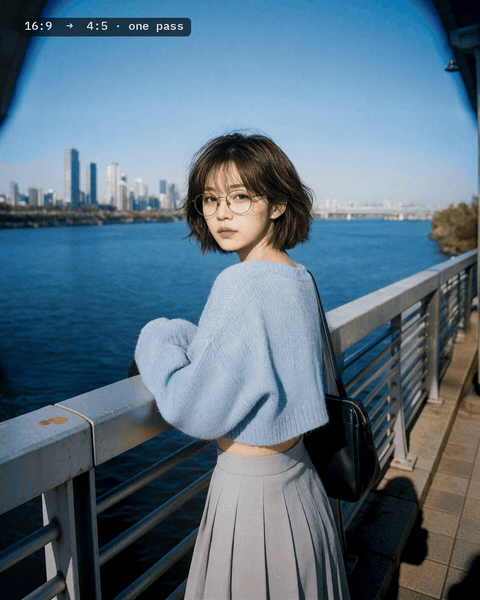

Here Krea 2 Outpaint takes a 16:9 photo to 4:5 in one pass. [Open the Krea 2 Outpaint workflow →](example_workflows/Krea%202%20Outpaint%20%28AusBoss%29.json)

The patch relies on ComfyUI's internal attention code. Its [help page](js/docs/AUSBOSS_NODES_Krea2OutpaintModelPatch.md) explains both setups and what happens without reference conditioning.

## Workflow utilities

Core ComfyUI has its own nodes for most of these jobs, and they work fine. These versions add the extras described under each one.

### Latent Size

Sets a canvas size. Pick landscape or portrait, a ratio and a megapixel budget, or drag the canvas handles. Orientation stays separate from the ratio, even on square. Typed sizes stay exact, and how drags snap is adjustable. It was called Resolution Master before 2.4.0.

It returns `width`, `height` and an empty image latent. The gear picks the latent layout (4, 16 or 128 channels) and the batch size. The latent's size rounds down to whole latent cells, so pick sizes that suit the layout when you wire the latent to a sampler. For video, use `width` and `height` with the model's own video latent node.

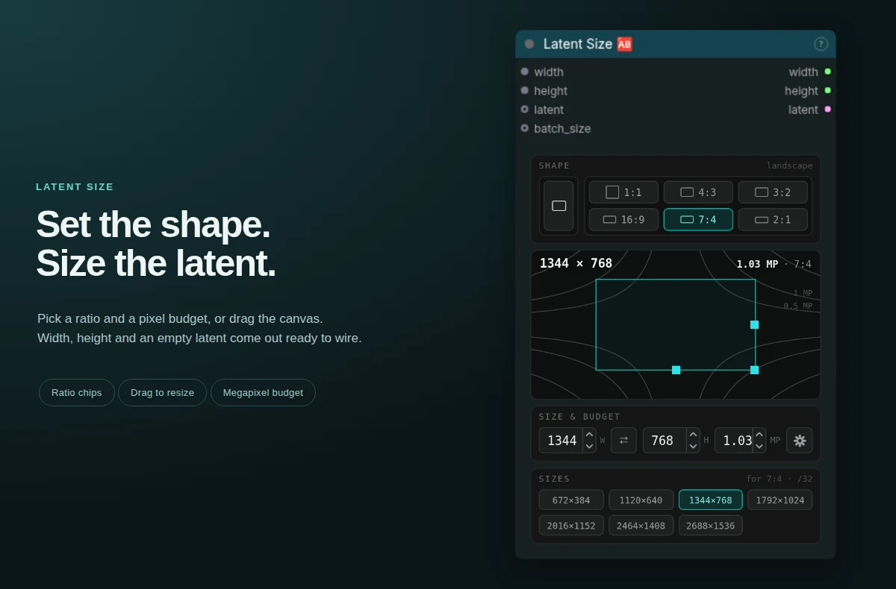

### Seed

One seed for several samplers. **Random**, **Fixed** and **Step** set what happens after each run. Switching to Random, or from Fixed to Step, changes the seed right away, so the next run is a new one. **New seed** rolls a value and keeps it. **Use last run** brings back the seed the last run actually used. The history menu keeps the last eight seeds and saves them with the workflow.

### Select Every Nth

Keeps every nth picture of a batch, after an offset that counts from 0. With nth 2, offset 0 keeps frames 1, 3 and 5, and offset 1 keeps 2, 4 and 6. The order stays the same. Wire the batch's fps in, and the `fps` output is divided by nth, so the thinned clip still lasts as long.

### Split Batch

Splits a batch after a frame number, counting from 1. Output `a` ends with that frame, and `b` gets the rest. Each side needs at least one frame, so a split point that breaks that stops with an error that gives the valid range.

### Merge Batches

Puts batch `b` after `a`. When the sizes match, nothing is resized. When they differ, it resizes to a's size or b's size, or stops with an error, whichever you pick. Both need the same number of channels.

### Text

A text box that grows with the node and sends its text, unchanged, down a `STRING` wire. Use it for a prompt, caption, path or other text that several nodes share. Spaces and line breaks are kept.

### Integer

One whole number (`INT`) on a scrub control, for sharing a size, count or other whole number across nodes.

### Float

One decimal number (`FLOAT`) on a scrub control, for sharing a strength, scale, frame rate or duration across nodes.

### Math Expression

Works out a number from linked `a`, `b` and `c` inputs, each an integer or a decimal. An input left unwired counts as 0. It handles arithmetic plus `min`, `max`, `abs`, `round`, `floor`, `ceil` and `sqrt`, for example `a * 2` or `ceil(a / 32) * 32`. It returns a float and a rounded integer, and halves round away from zero. The expression is parsed, never run as Python code.

### Show Text

Shows incoming text in a panel you can select from and resize, and passes it on unchanged. The last text shown saves with the workflow. Very long text may be cut short on screen, but the output keeps all of it. It runs as an output node, so nothing has to be connected after it.

### Free Memory

Passes any value through and, on the way, unloads ComfyUI's cached models, runs Python's garbage collection and clears the CUDA cache where there is one. Put it between two heavy stages when the second one needs the room. It runs only when its input changes, like any cached node, and later stages may take longer while models load again.

### Workflow Note

A setup card for a shared workflow: a title, instructions in Markdown, each model's download link and folder, the node packs it needs, and your links. It checks the models and packs against the install it's opened in. **Edit** changes the card, and **Banner** turns it into a small section title. The note never runs, and its text is never shown as raw HTML.

### Run Timer

A stopwatch for the whole run, with no wires. It starts when the queue starts running, holds the total when the run ends, and saves the last time with the workflow. Recent times are in its right-click menu. You can resize it. It only shows time and doesn't change how the graph runs.

## Example workflows

These are the workflows where the nodes do something core ComfyUI doesn't do by itself: outpainting and inpainting that put your original picture back, lining an edit back up with its source, and removing a watermark from a clip. Open a JSON file from [`example_workflows/`](example_workflows), or find them under this pack in ComfyUI's template browser. Each one has a thumbnail, numbered groups and a Workflow Note with the setup steps and model downloads.

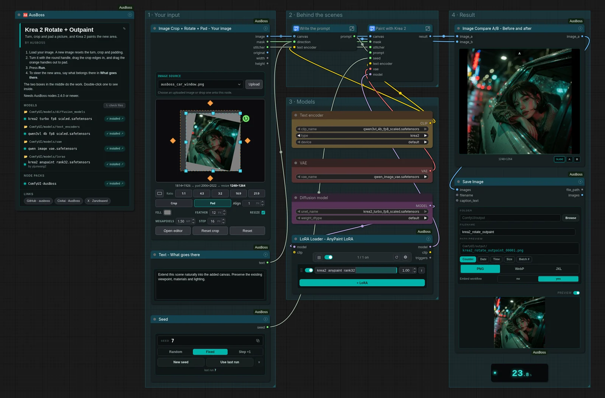

The examples use this layout: named groups for your input, the models and the result, with the plumbing inside two boxes you can double-click to open.

The workflows open with their image and video loaders empty, so you load your own picture or clip. To try one with a sample first, copy the pier photo or the short pier clip from [`example_workflows/inputs/`](example_workflows/inputs) into `ComfyUI/input/`. If you keep models in subfolders, pick your copy in each loader before you run. A green model check on the note only means the file exists; it doesn't mean the loader has that file selected. The models' licenses and any download terms are their authors'.

| Workflow | What it does | What you need |
|---|---|---|
| [Krea 2 Outpaint](example_workflows/Krea%202%20Outpaint%20%28AusBoss%29.json) | Pick a ratio or drag the orange handles out, and Krea 2 paints the new area | Krea 2 Turbo and the AnyPaint LoRA; its text encoder also writes the caption |
| [Krea 2 Inpaint Masked](example_workflows/Krea%202%20Inpaint%20Masked%20%28AusBoss%29.json) | Paint over part of a picture, say what goes there, and Krea 2 repaints only that | Krea 2 Turbo and the AnyPaint LoRA |
| [Krea 2 Rotate + Outpaint](example_workflows/Krea%202%20Rotate%20%2B%20Outpaint%20%28AusBoss%29.json) | Turn, crop and pad a picture, and Krea 2 paints the new area | Krea 2 Turbo and the AnyPaint LoRA |
| [Klein 9B Outpaint](example_workflows/Klein%209B%20Outpaint%20%28AusBoss%29.json) | Extend a picture with the PixaOutpaint LoRA, then stitch the original back | Distilled Klein 9B, its Qwen encoder and the Flux 2 VAE, the PixaOutpaint LoRA, and Qwen3-VL 8B INT8 for the caption |
| [LTX 2.3 Video Outpaint](example_workflows/LTX%202.3%20Video%20Outpaint%20%28AusBoss%29.json) | Widen a vertical clip, keeping its audio and original pixels | LTX 2.3, the distilled LoRA and the outpaint IC-LoRA |
| [Qwen Image 2.1 Edit + Realign](example_workflows/Qwen%20Image%202.1%20Edit%20%2B%20Realign%20%28AusBoss%29.json) | Type a short edit, and Realign to Source lines Qwen's result back up with your picture | Qwen Image 2.1 INT8, Qwen3-VL 8B INT8 and the 2.1 VAE |
| [Simple Video Watermark Remover](example_workflows/Simple%20Video%20Watermark%20Remover%20%28AusBoss%29.json) | Find an overlay in a clip and remove it, with a one-frame comparison branch | ComfyUI's own SAM 3.1 (ComfyUI 0.20 or newer), plus `big-lama.pt` |

Every example uses only core nodes and this pack. Speed and memory use depend on the models, the sizes, the frame count and whatever else is using the GPU.

## For workflow creators

If you share workflows, a few of these nodes help the people who download them:

- **Workflow Note** puts a setup card on the canvas with each model's download link, folder and size, the node packs it needs and your links, and checks them against the reader's install.
- **Image Compare A/B** shows the result against its source with a slider.
- **Seed** keeps runs repeatable, and **Use last run** brings back the seed the last run used.
- **Run Timer** shows how long the whole run took, so a speed note is measured.
- **Save Image** embeds the workflow in PNG, lossless WebP or JPEG XL files, with names you control.

People who download your workflow get the nodes through ComfyUI-Manager's missing-node install, like any other pack.

## Pack-wide tools

- **Help cards:** the **?** in a node's title bar opens its description, inputs and outputs. Run Timer has no title bar, so it has **About this node** in its right-click menu.
- **Recreate node 🆎** (right-click an AusBoss node) rebuilds a node saved by an older version from the current definition. It keeps the values, links, position and colors.
- **Replace with AusBoss nodes 🆎** (canvas right-click or the command palette) finds third-party nodes this pack can stand in for, such as VideoHelperSuite's Load Video and Video Combine or KJNodes' Color Match. It previews each swap and replaces the ones you leave ticked.
- **Node colors:** Settings → 🆎 AusBoss → Appearance sets the scheme for every AusBoss node (AusBoss, Graphite, Slate, Teal, Moss, Plum, Rust, Navy, Custom or Theme default). A node's right-click **AusBoss color** menu recolors just that node, and nodes you colored by hand keep their colors.
- **Run status:** under Settings → 🆎 AusBoss → Chrome, the queue status can show in the browser tab's title and icon, running nodes get live progress badges, and each node's run time can be shown.
- **Completion sound:** Settings → 🆎 AusBoss → Notifications plays a short chime when the queue finishes.

## Editor controls and settings

- Drag a number box to scrub it, or click it to type. Hold Shift for fine steps.
- Hold Shift while you turn the green rotation handle to snap to 15° steps.
- In the full-screen editor, the mouse wheel zooms, and the middle mouse button or Alt-drag pans. On the node itself, the wheel and middle mouse button still move the graph.
- **Alt+E** opens the selected node's transform editor. Change the key in Settings → Keybindings.
- The video editors have frame stepping, playback and exact timeline seeking, on the node face as well as in the editor. The Clip node's IN and OUT handles sit on the source's own frames, so the frame shown for IN is the first one decoded and the frame shown for OUT is the last.
- Your own aspect presets go in `ausboss_presets.json` beside the pack. Copy [`ausboss_presets_example.json`](ausboss_presets_example.json) to start. Your file survives updates.

LoRA Loader and Latent Size have their own gear menus for per-node preferences.

The video transform nodes' Server file mode reads only videos inside ComfyUI's input, output and temp folders, and Save Image writes only inside the output folder. No widget can point the pack anywhere else on the disk. See [the video transform help](js/docs/AUSBOSS_NODES_VideoCropRotatePad.md).

## Optional extras

Three features need an extra Python package. Install it with the Python that runs ComfyUI. For the Windows portable build, that is `python_embeded\python.exe -m pip install ...` from the portable folder.

```bash
python -m pip install opencv-contrib-python   # Mask Refine: guided filter
python -m pip install "pymatting>=1.1"        # Mask Refine: matting; Stitch Inpaint: edge halo
python -m pip install pillow-jxl-plugin       # Save Image: lossless JPEG XL
```

The default mask settings, ordinary stitching, PNG and lossless WebP don't need them. Optical flow needs RAFT weights on disk, and the node's help page explains the setup. Which video codecs you have depends on your ComfyUI environment.

## Compatibility and development

The pack needs ComfyUI **0.27.1** or newer. An example for a newer model needs a ComfyUI core that supports that model, and updating only this pack can't add it. It is tested with ComfyUI **0.37.0** and frontend **1.53.6**. It works on the classic canvas and in Nodes 2.0, and running a workflow doesn't need an editor open.

Backend changes need a full ComfyUI restart, and frontend changes need a hard refresh. Run the backend tests with ComfyUI's Python:

```bash
python scripts/validate_nodes.py
python scripts/release_preflight.py
python scripts/run_python_tests.py
node --test tests/*.test.mjs
```

The backend tests run in separate processes, because their offline ComfyUI stubs must not leak between files. [CONTRIBUTING.md](CONTRIBUTING.md) covers bug reports and pull requests. [`docs/live_testing.md`](docs/live_testing.md) covers canvas, mouse-drag, save and reload, and workflow checks, and [`docs/adding_a_node.md`](docs/adding_a_node.md) lists what a new public node needs.

## Feedback

Bug reports and workflow ideas are welcome in [issues](https://github.com/ausboss/ComfyUI-AusBoss/issues). Security problems go through [SECURITY.md](SECURITY.md). Every release is in the [changelog](CHANGELOG.md). If a node saves you time, a star on GitHub helps other people find it.

## License

MIT. See [`LICENSE`](LICENSE).
